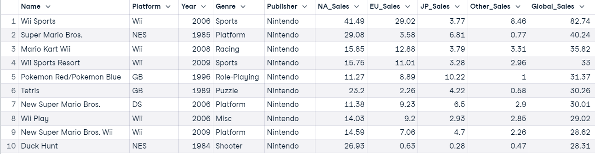

# Project Data Analysis

## DATASET :file_folder:

### Video Games Sales Data :video_game:
This dataset contains records of popular video games in North America, Japan, Europe and other parts of the world. Every video game in this dataset has at least 100k global sales.

---------------------------------------------------

### challenges :computer:

1.Top 5 platform seals
2.Create a plot visualizing the average sales for games in the most popular three genres. Differentiate between NA, EU, and global sales.
3.sales over the yeras